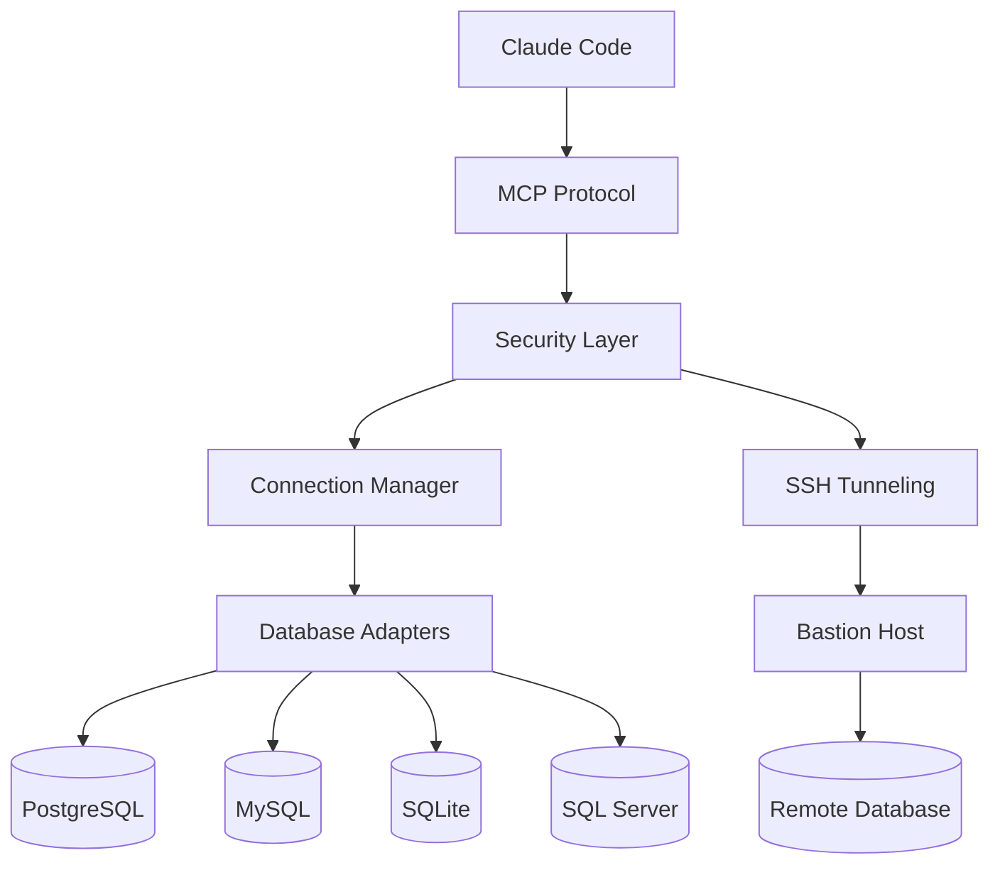

<div align="center">

# Argos-MCP

**A hundred eyes on your databases, and none of them blink.**

[](https://github.com/AraneaDev/Argos-MCP/releases)
[](https://aranea-development.nl/en/tools/argos-mcp)
[](https://github.com/AraneaDev/Argos-MCP/actions/workflows/ci.yml)
[](https://github.com/AraneaDev/Argos-MCP/actions/workflows/ci.yml)
[](./LICENSE)
[](https://github.com/AraneaDev/Argos-MCP)
[](https://github.com/AraneaDev/Argos-MCP/commits/main)
[](https://www.conventionalcommits.org/)
[](https://mcpobservatory.com/servers/github:AraneaDev/Argos-MCP/security)
[](#quick-start)

</div>

> **Argos Panoptes** (Ἄργος Πανόπτης) is the giant of Greek myth with a hundred eyes, set by
> Hera to guard Io. Only some of his eyes slept at a time, so he was never fully asleep and
> nothing passed him unseen. *Panoptes* means "all-seeing".

Argos-MCP connects Claude Code to PostgreSQL, MySQL, SQLite, and SQL Server with strong
security defaults, per-query auditing, and multi-database support. Every query is watched, and
nothing reaches your data unlogged.

> **Status:** pre-release. Argos-MCP is **not yet published to npm**, and the publish step in
> the release workflow is deliberately dormant. The source is public on
> [GitHub](https://github.com/AraneaDev/Argos-MCP), so install from source (see
> [Quick start](#quick-start)). Any `npm install -g argos-mcp` command you find elsewhere will
> not resolve yet.

---

## Why Argos-MCP?

### **Security First**
- **SELECT-Only Mode** - Production-safe read-only database access
- **Query Validation** - Bound parameters, stacked statements refused, comment- and literal-aware parsing, complexity limits
- **SSH Tunneling** - Secure encrypted connections through bastion hosts
- **Audit Logging** - One record per query: database, statement hash, duration, outcome, never the values

### **High Performance**
- **Connection Pooling** - Efficient database connection management
- **Schema Caching** - Captured once per database, reused for the session
- **Query Optimization** - Built-in performance analysis and recommendations
- **Batch Operations** - Execute multiple queries with transaction support

### **Universal Database Support**
- **PostgreSQL** - Full support including advanced features
- **MySQL/MariaDB** - Via mysql2, including Azure Database for MySQL/MariaDB
- **SQLite** - Perfect for development and small applications
- **SQL Server** - Enterprise-grade Microsoft SQL Server support

### **Developer Experience**
- **One-command install** - Registers with Claude Code via the native `claude mcp add`
- **TypeScript Native** - Full type safety and IntelliSense support
- **Comprehensive Docs** - Detailed guides, tutorials, and API reference
- **Extensive Testing** - Unit and integration suites, plus mutation testing on the security-critical paths

## Quick start

**Requirements:** Node.js >= 22 and the [Claude Code CLI](https://docs.claude.com/en/docs/claude-code).

### 1. Build
```bash
git clone https://github.com/AraneaDev/Argos-MCP.git
cd Argos-MCP
npm install
npm run build
```

### 2. Configure databases
```bash
npm run setup
```
Interactive wizard for adding database connections, security settings, and SSH tunnels. It writes a `config.ini`, by convention at `~/.config/argos/config.ini`, though any path works. You can also add databases at runtime with the `sql_add_database` tool.

### 3. Register with Claude Code
```bash
claude mcp add argos --scope user -- \
  node "$(pwd)/dist/index.js" --config "$HOME/.config/argos/config.ini"
```

Scopes:

| Scope | Flag | Where it lives | Use when |
|-------|------|----------------|----------|
| User | `--scope user` | `~/.claude.json` | You want Argos in every project (most common) |
| Project | `--scope project` | `.mcp.json` in the repo | You want to share it with your team via git |
| Local | *(default)* | Per-project, private | You're just trying it out |

### 4. Verify
```bash
claude mcp list
```
You should see `argos` listed as connected. Its tools appear in Claude Code as `mcp__argos__sql_query`, `mcp__argos__sql_get_schema`, and so on.

### Removing it
```bash
claude mcp remove argos --scope user
```

## Use cases

### **Data Analytics & Business Intelligence**
> "Show me the top 10 customers by revenue this quarter, including their growth rate compared to last quarter"

### **Production Database Monitoring**
> "Check the status of our user registration system - how many signups in the last 24 hours and any error patterns?"

### **Database Administration**
> "Analyze the performance of our product catalog queries and suggest optimizations"

### **Development & Testing**
> "Generate test data scenarios based on our current user demographics"

## Architecture



**Built on solid foundations:**
- **TypeScript** - Full type safety and modern development experience
- **Node.js** - Cross-platform compatibility and excellent ecosystem
- **MCP Protocol** - Standard protocol for AI tool integration
- **Industry-standard drivers** - Proven database connectivity libraries

## Documentation hub

### **Getting Started**
- **[5-Minute Quick Start](docs/guides/quick-start.md)** - Get running fast
- **[Installation Guide](docs/guides/installation-guide.md)** - Detailed setup instructions
- **[First Database Tutorial](docs/tutorials/02-first-database.md)** - Connect your first database
- **[Claude Integration](docs/tutorials/03-claude-integration.md)** - Register with Claude Code

### **Architecture & Design**
- **[System Architecture](docs/architecture/system-architecture.md)** - How it all works together
- **[Security Architecture](docs/architecture/security-architecture.md)** - Defense-in-depth security model
- **[Database Layer](docs/architecture/database-layer.md)** - Adapter pattern implementation

### **API Reference**
- **[MCP Tools Reference](docs/api/mcp-tools-reference.md)** - Complete tool documentation
- **[TypeScript API](docs/api/typescript-api.md)** - Developer API reference
- **[Configuration Reference](docs/guides/configuration-guide.md)** - All configuration options

### **Advanced Guides**
- **[Multi-Database Setup](docs/tutorials/advanced-01-multi-database.md)** - Managing multiple databases
- **[SSH Tunneling](docs/tutorials/advanced-02-ssh-tunnels.md)** - Secure remote access
- **[Security Hardening](docs/operations/security-hardening.md)** - Production security guide
- **[Performance Tuning](docs/operations/performance-tuning.md)** - Optimization strategies

**[Browse All Documentation](docs/README.md)**

## Configuration examples

### Production PostgreSQL with SSH
```ini
[database.production]
type=postgresql
host=internal-db.company.local
port=5432
database=production_app
username=readonly_user
password=secure_random_password
ssl=true
select_only=true
timeout=15000

# SSH Tunnel Configuration
ssh_host=bastion.company.com
ssh_port=22
ssh_username=tunnel_user
ssh_private_key=/secure/path/ssh_key
# Required: without a pinned fingerprint the tunnel refuses to connect, rather
# than trusting whatever host key it is offered. Get it from the bastion with
#   ssh-keygen -lf /etc/ssh/ssh_host_ed25519_key.pub
ssh_host_fingerprint=SHA256:47DEQpj8HBSa+/TImW+5JCeuQeRkm5NMpJWZG3hSuFU

[security]
max_joins=5
max_subqueries=3
max_complexity_score=50
```

### Multi-Database Analytics Setup
```ini
[database.transactions]
type=postgresql
host=transactions-db.company.com
database=transactions
select_only=true

[database.users]
type=mysql
host=users-db.company.com
database=users
select_only=true

[database.analytics]
type=sqlite
file=./data/analytics.sqlite
select_only=false

[database.local_cache]
type=sqlite
file=./data/cache.sqlite
select_only=false
mcp_configurable=true

[extension]
max_rows=1000
query_timeout=30000
```

## Security features

### Multi-Layer Security Model
1. **Query Validation** - SQL injection prevention and syntax analysis
2. **Complexity Limits** - Prevent resource-intensive queries
3. **SELECT-Only Mode** - Read-only database access for production safety
4. **Connection Encryption** - SSL/TLS and SSH tunnel support
5. **Audit Logging** - Comprehensive security event tracking
6. **[Field Redaction](docs/features/field-redaction.md)** - Automatic masking of sensitive data in query results

### Field Redaction

Automatically mask, replace, or partially obscure sensitive fields (emails, phone numbers, SSNs, etc.) in query results before they reach Claude or other clients. Redaction is configured per-database in `config.ini`:

```ini
[database.production]
type=postgresql
host=prod-db.company.com
database=app_db
username=readonly_user
password=secure_pass
select_only=true

# Field Redaction
redaction_enabled=true
redaction_rules=*email*:partial_mask,*phone*:full_mask,ssn:replace:[PROTECTED]
redaction_case_sensitive=false
redaction_log_access=true
```

**Redaction types:**
| Type | Example Input | Example Output |
|------|--------------|----------------|
| `partial_mask` | `john.doe@example.com` | `j******.e@*****.com` |
| `full_mask` | `555-123-4567` | `**********` (capped at 10) |
| `replace` | `123-45-6789` | `[PROTECTED]` |
| `custom` | Regex-based | Custom pattern |

**Field patterns:** exact match (`email`), wildcard (`*email*`), or regex (`/^user_.+$/`).

**[Full Redaction Guide](docs/features/field-redaction.md)**

### What this gives you towards compliance

Argos is not certified against any standard, and no library can be. Compliance
is a property of your deployment. What it provides is the controls and the
evidence that such a regime asks for:

- Read-only enforcement that cannot be relaxed from a session
- Field redaction, so protected columns never reach the model
- An audit record per query: timestamp, database, statement hash, duration,
  outcome, with no values and no SQL
- Secrets scrubbed from logs and error messages
- Owner-only file modes on the log, the audit records and the configuration

## Dynamic database management

Argos-MCP supports runtime database management through dedicated MCP tools. This allows you to add, update, and remove database connections without restarting the server.

### Available MCP Tools

| Tool | Description | Requirements |
|------|-------------|--------------|
| `sql_add_database` | Add new database connections at runtime via MCP | None |
| `sql_update_database` | Update existing database settings via MCP | `mcp_configurable=true` on the target database |
| `sql_remove_database` | Remove database connections via MCP | `mcp_configurable=true` on the target database |
| `sql_get_config` | View database configuration (passwords are automatically redacted) | None |
| `sql_set_mcp_configurable` | Lock a database from MCP changes | One-way operation: can only lock (`false`), unlocking requires manual config edit |

### Usage Notes

- Set `mcp_configurable=true` in your database config to allow MCP-driven updates and removal.
- The `sql_set_mcp_configurable` tool is a one-way lock: once set to `false`, the database can no longer be modified or removed via MCP. Unlocking requires a manual edit to the configuration file.
- The `sql_get_config` tool always redacts passwords and other sensitive fields before returning configuration data.
- Databases added at runtime via `sql_add_database` have `mcp_configurable=true` by default, and are **always** `select_only=true`. Granting write access requires editing `config.ini` by hand, so the model cannot grant it to itself.

## Performance

Query time is your database's, not Argos's. It adds validation and formatting
around a normal client connection. `sql_get_metrics` reports the latency it
actually observed (min, max, avg, p95), and `sql_analyze_performance` returns the
execution plan with dialect-specific advice when something is slow.

### Performance Features
- **Connection Pooling** - Reuse database connections efficiently
- **Schema Caching** - Instant metadata access after initial capture
- **Query Optimization** - Built-in EXPLAIN plan analysis
- **Result Streaming** - Handle large datasets efficiently
- **Batch Operations** - Execute multiple queries optimally

## CLI commands

| Command | Description |
|---------|-------------|
| `argos-mcp` | Start the Argos MCP server on stdio (this is what Claude Code invokes) |
| `argos-setup` | Run the interactive configuration wizard |

Both are exposed as `bin` entries, so `npm link` (or a global install) makes them available on your `PATH`. Registration with Claude Code is handled by `claude mcp add`, see [Quick start](#quick-start).

## Development

### Development Setup
```bash
git clone https://github.com/AraneaDev/Argos-MCP.git
cd Argos-MCP
npm install
npm run dev
npm test
```

**[Full Development Guide](docs/development/development-setup.md)**

### Architecture gate

`knossos.json` declares the layers of this codebase and the dependency rules
between them, and the `Architecture` workflow enforces those rules on every pull
request. The layers run from `types` at the bottom, through `utils`, `adapters`
and `domain`, up to `mcp-tools`, with `setup-cli` off to the side; a lower layer
may never depend on a higher one. Adding an import that breaks a rule fails CI
with the offending file and line.

The workflow also runs a budget check that compares each commit against a
reviewed baseline and fails on regressions such as a new dependency cycle. That
half stays dormant until you adopt a baseline:

1. Open the latest `Architecture` run on `main` and download the
   `knossos-architecture` artifact.
2. Read `scan.json` and take its `snapshot_id`.
3. Save it as the `KNOSSOS_BASELINE_SNAPSHOT` repository variable.

Re-adopt a newer snapshot when a deliberate architectural change makes the old
baseline meaningless. Never move it just to make a red pull request go green.

The scan reports several thousand error diagnostics for the `tests` tree. That
is a side effect of `tsconfig.json` excluding `tests`, which leaves the analyzer
type-checking those files without the Jest globals. `npm run type-check` is the
authority on whether this repository compiles, and the architecture budgets
deliberately do not gate on the diagnostic count.

## License

Released under the [MIT License](./LICENSE), free for any use, commercial
included, with no warranty. It speaks any MCP client, not just Claude Code, and
connects to databases you already run.

## Acknowledgments

### Built With
- **TypeScript** - Language and tooling
- **Node.js** - Runtime platform
- **Jest** - Testing framework
- **ESLint** - Code quality
- **MCP Protocol** - AI integration standard

### Special Thanks
- **[Anthropic](https://anthropic.com)** - For Claude AI and MCP protocol
- **[TypeScript Team](https://www.typescriptlang.org/)** - For excellent tooling
- **Database Driver Maintainers** - For reliable connectivity libraries

---

<div align="center">

**[Get Started Now](docs/guides/quick-start.md)** | **[Documentation](docs/README.md)**

*Transform your database interactions with AI-powered SQL intelligence*

</div>
